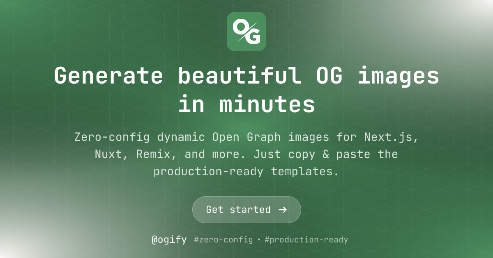
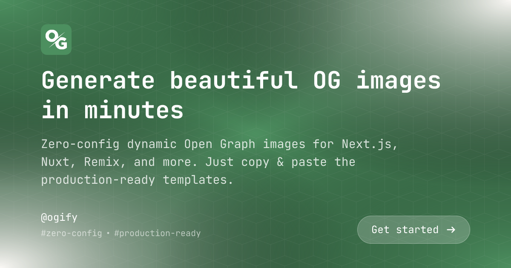
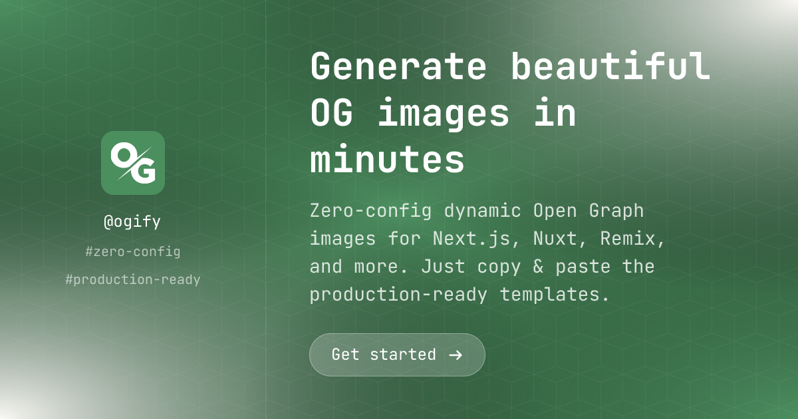
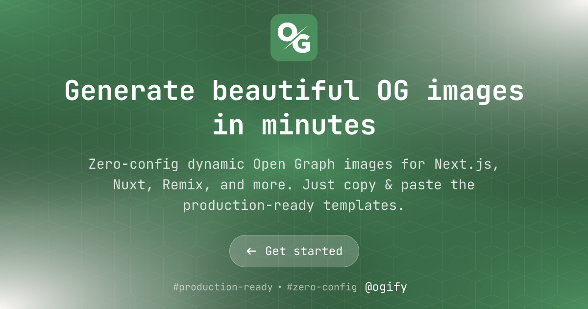
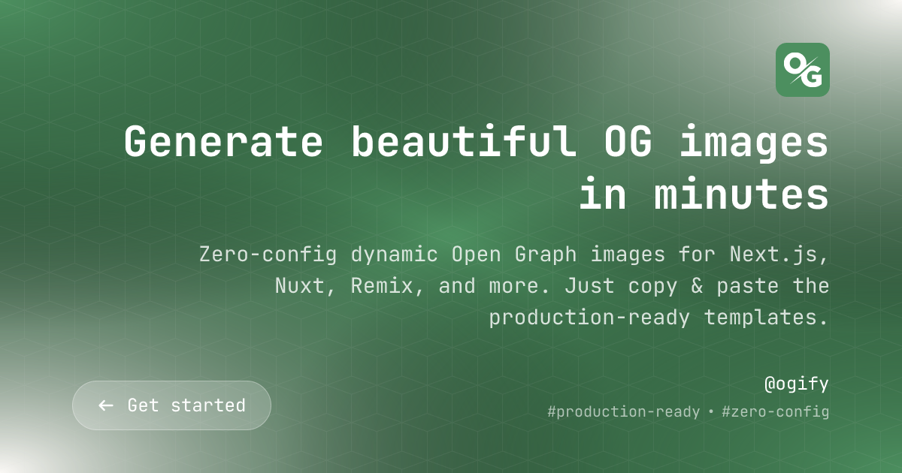
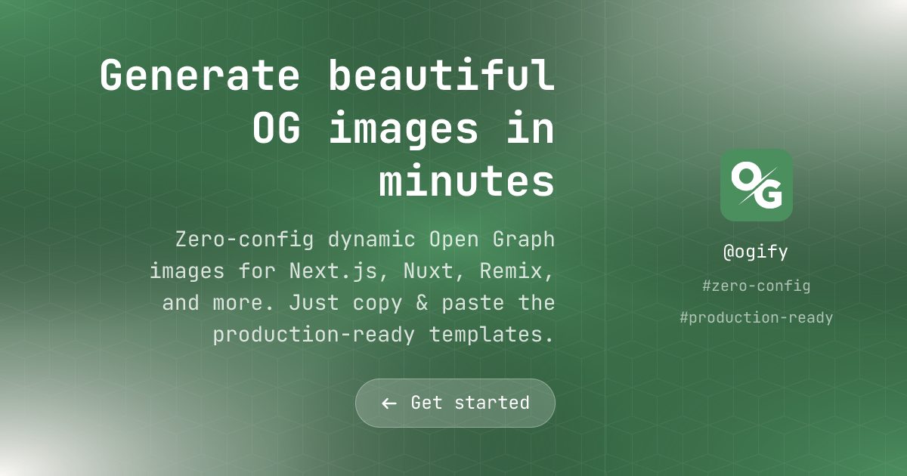

# Basic Template

The **Basic** template is a versatile, production-ready template suitable for various use cases: blog posts, announcements, product launches, and general-purpose Open Graph images.

## Features

- 🎨 **Three Layout Options**: Centered, Aligned, and Split layouts
- 🌍 **RTL Support**: Full support for right-to-left languages
- 🎨 **Customizable Colors**: Primary, secondary, and text colors
- 🖼️ **Brand Integration**: Logo and brand name support
- 🔘 **Call-to-Action**: Optional CTA button
- 📋 **Extra Metadata**: Display tags, dates, or other info

## Basic Usage

```typescript
import { createRenderer } from '@ogify/core';
import template from '@ogify/templates/basic';
import type { TemplateParams } from '@ogify/templates/basic';

const renderer = createRenderer<{ basic: TemplateParams }>({
  templates: { basic: template },
});

const imageBuffer = await renderer.renderToImage('basic', {
  title: 'Building Modern Web Apps',
  subtitle: 'A comprehensive guide to Next.js and React',
  layout: 'split',
  primaryColor: '#3b82f6',
  brandName: 'Tech Blog',
  cta: 'Read More',
});
```

## Parameters

| Parameter | Type | Required | Default | Description |
| --------- | ---- | -------- | ------- | ----------- |
| `title` | `string` | ✅ | - | Main headline of the image |
| `subtitle` | `string` | ❌ | - | Secondary description or tagline |
| `layout` | `'aligned' \| 'centered' \| 'split'` | ❌ | `'aligned'` | Visual arrangement of elements |
| `brandName` | `string` | ❌ | - | Your brand or website name |
| `brandLogo` | `string` | ❌ | - | URL to your brand logo |
| `cta` | `string` | ❌ | - | Call-to-action text (e.g., "Read More") |
| `primaryColor` | `string` | ❌ | `'#4c8f5f'` | Primary theme color (hex code) |
| `secondaryColor` | `string` | ❌ | `'#faf8f5'` | Secondary theme color (hex code) |
| `textColor` | `string` | ❌ | `'#fff'` | Text color (hex code) |
| `extras` | `string[]` | ❌ | `[]` | Array of extra tags or metadata |
| `pattern` | `string` | ❌ | Default texture | URL to a background pattern image |

## Layouts

### Centered Layout

Perfect for simple announcements and centered content.

```typescript
const imageBuffer = await renderer.renderToImage('basic', {
  title: 'New Feature Released!',
  subtitle: 'Check out our latest updates',
  layout: 'centered',
  brandLogo: 'https://example.com/logo.png',
  brandName: 'My App',
  extras: ['January 2026', 'Product Update'],
});
```



**Visual Description**: All content is centered vertically and horizontally. Logo appears at the top, followed by title, subtitle, CTA, and metadata at the bottom.

### Aligned Layout

Best for blog posts and content-heavy images.

```typescript
const imageBuffer = await renderer.renderToImage('basic', {
  title: 'The Future of Web Development',
  subtitle: 'Exploring new trends and technologies',
  layout: 'aligned',
  brandLogo: 'https://example.com/logo.png',
  brandName: 'Tech Insights',
  cta: 'Read Article',
  extras: ['5 min read', 'Web Development'],
});
```



**Visual Description**: Content is left-aligned (or right-aligned for RTL). Logo at the top-left, title and subtitle stacked, with brand info and CTA at the bottom.

### Split Layout (Default)

Great for balancing branding and content.

```typescript
const imageBuffer = await renderer.renderToImage('basic', {
  title: 'Introducing OGify 2.0',
  subtitle: 'Generate beautiful OG images with ease',
  layout: 'split',
  brandLogo: 'https://example.com/logo.png',
  brandName: 'OGify',
  extras: ['Open Source', 'TypeScript'],
  primaryColor: '#6366f1',
  secondaryColor: '#f0abfc',
});
```



**Visual Description**: Two-column layout. Left side (1/3 width) shows logo, brand name, and metadata. Right side (2/3 width) displays title, subtitle, and CTA.

## Color Customization

Customize the color scheme to match your brand:

```typescript
const imageBuffer = await renderer.renderToImage('basic', {
  title: 'Custom Brand Colors',
  layout: 'centered',
  primaryColor: '#ff6b6b',      // Vibrant red
  secondaryColor: '#4ecdc4',    // Teal
  textColor: '#ffffff',         // White text
});
```

The template uses a radial gradient background combining primary and secondary colors for a modern, dynamic look.

## RTL Support

The Basic template fully supports right-to-left languages:

```typescript
const imageBuffer = await renderer.renderToImage('basic', {
  title: 'مرحبا بالعالم',
  subtitle: 'دليل شامل لتطوير الويب الحديث',
  layout: 'aligned',
  brandName: 'مدونة تقنية',
}, {
  isRTL: true,
});
```

When `isRTL: true` is set, the layout automatically mirrors, text aligns to the right, and directional elements (like arrows in CTAs) flip appropriately.

### RTL Layout Examples


<!-- slide -->

<!-- slide -->


## Advanced Examples

### With Custom Pattern

```typescript
const imageBuffer = await renderer.renderToImage('basic', {
  title: 'Custom Background Pattern',
  subtitle: 'Using a custom texture',
  layout: 'split',
  pattern: 'https://example.com/pattern.png',
  primaryColor: '#1e293b',
  textColor: '#f1f5f9',
});
```

### Minimal Design

```typescript
const imageBuffer = await renderer.renderToImage('basic', {
  title: 'Clean and Simple',
  layout: 'centered',
  primaryColor: '#000000',
  secondaryColor: '#ffffff',
  textColor: '#ffffff',
});
```

## Tips

- **Keep titles concise**: Aim for 5-8 words for optimal readability
- **Use high-contrast colors**: Ensure text is readable against the background
- **Logo size**: Logos are automatically sized; use square or horizontal logos for best results
- **Pattern opacity**: Background patterns are displayed at 30% opacity by default
- **Extras array**: Keep to 2-3 items for best visual balance

## Related Documentation

- [Quick Start Guide](../../getting-started/quick-start.md)
- [Custom Templates](../../getting-started/custom-template.md)
- [RTL Support](../../getting-started/rtl.md)
- [Core API Reference](../core.md)
